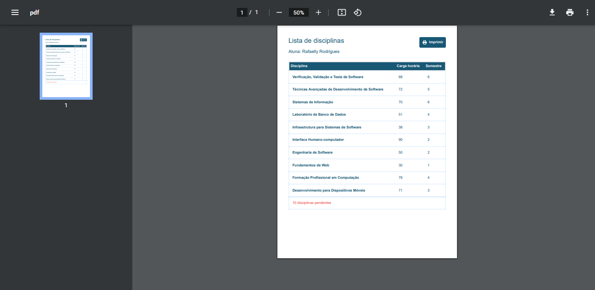

# Generating PDF file

## Tools

- NodeJS
- Puppeteer
- EJS
- TailwindCSS

## Demonstration

- page/pdf
<table>
<tr>
<td>  </td>
<td> 
   </td>
</tr>
</table>

## Author

Rafaelly Rodrigues

- @moonrafa
